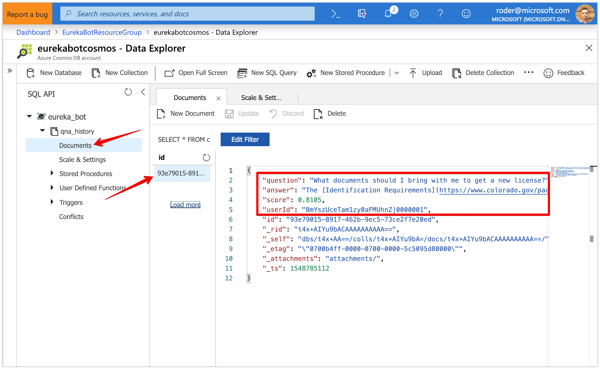
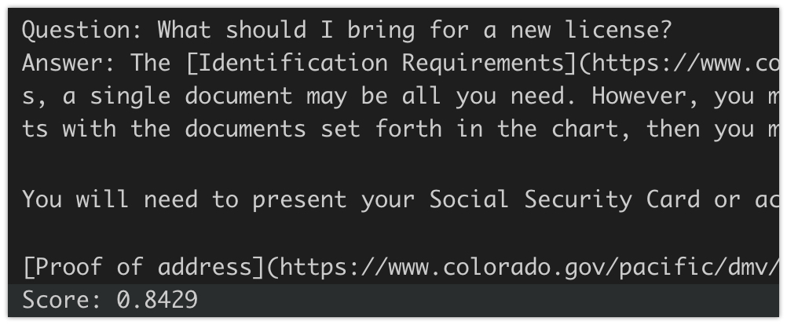
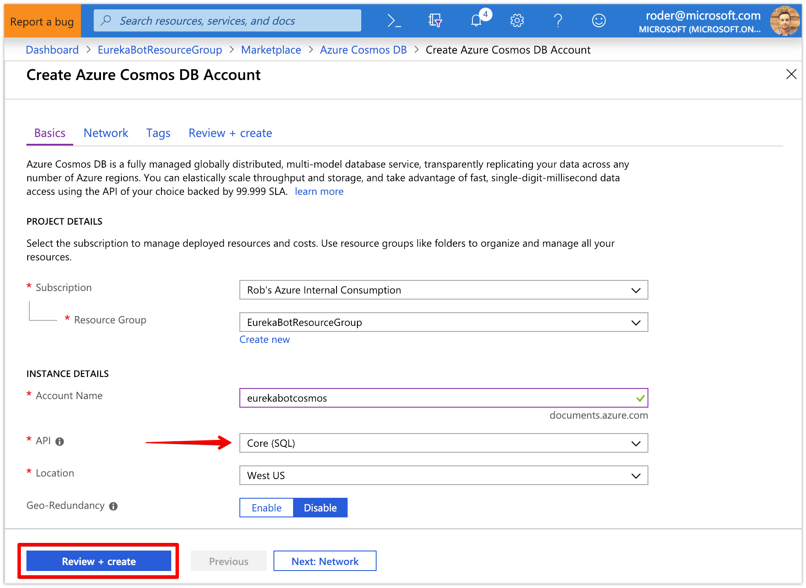
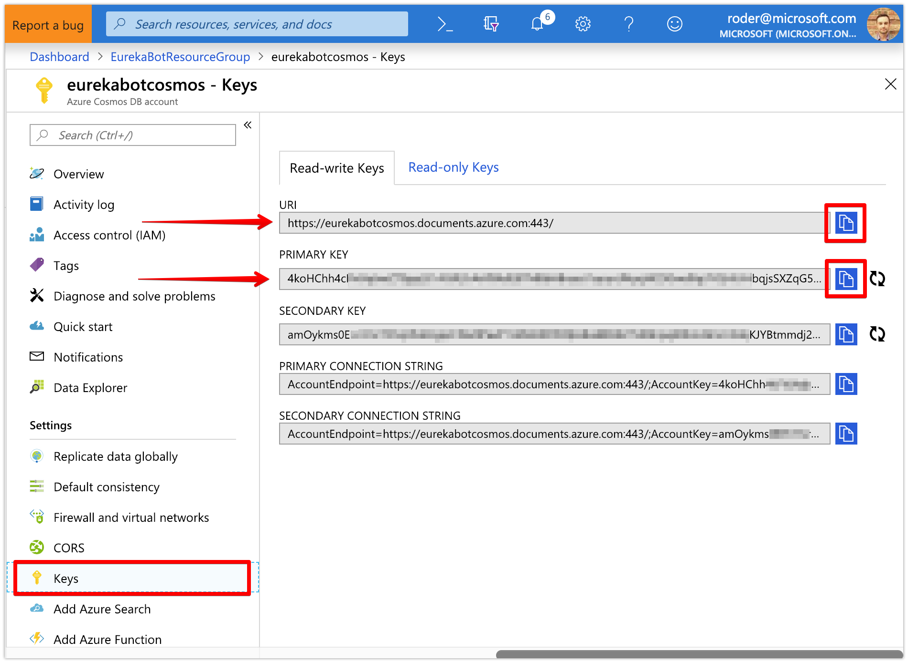

# Azure Bot Framework - Conversation Logger as Middleware

### This guide will help you integrate custom middleware to log conversations to a Cosmos database.

When you've completed this tutorial, you should expect to see this:
<br/><br/><br/>

### What is Middleware?

Middleware is a new concept in Bot Framework v4 and is aimed at making it very easy to splice intelligent layers into your bot. Middleware will will execute in the order added in the `Startup.cs` file both up and down the middleware stack. Examples of middleware are translation, spell-check, logging and natural language entity extraction. For additional information on how middleware works, check out the [docs here](https://docs.microsoft.com/en-us/azure/bot-service/bot-builder-concept-middleware).
<br/>


### What is Cosmos DB?

Azure Cosmos DB was built from the ground up with global distribution and horizontal scale at its core. It offers turnkey global distribution across any number of Azure regions by transparently scaling and replicating your data wherever your users are. Elastically scale your writes and reads all around the globe, and pay only for what you need.

Azure Cosmos DB provides native support for NoSQL and OSS APIs including MongoDB, Cassandra, Gremlin and SQL. Today, we'll be using the SQL document API since it will be very familiar to anyone that has experience with TSQL.

<br />

### Section 1: Add in `ConversationLogger` Middleware

1. Let's get the conversation logger to write history to the console first by adding [this file](https://gist.github.com/rob-derosa/6fe64f426a785eca41a00e461ab4652e) to our project in a new folder called `Middleware`

1. Open up the file `EurekaBot\Middleware\ConversationLogger.cs` and read the comments to understand the flow of how middleware will process the incoming message from the user as well as the outgoing message from the bot

1. Now that we have middleware in our project, we need to add it to the startup process - open the `Startup.cs` file and add the following line of code just after setting the `options.OnTurnError` property delegate, within the `services.AddBot` delegate body:
	```
	options.Middleware.Add(new ConversationLogger(botConfig));
	```

1. Open the `Bot.cs` file and replace the contents of the `if (results != null && results.Any())` statement within the `LookupAnswerInKowledgeBase` method with the following code:
	```
	var result = results.First();
	var reply = turnContext.Activity.CreateReply(result.Answer);

	//We want to track tag the score too so Middleware has access to it
	reply.Properties.Add("qna_score", result.Score);

	//Return the first result (you could also ensure the result.Score is of a minimum threshold)
	await turnContext.SendActivityAsync(reply);
	```

	Instead of just replying with a string, we're creating an `Activity` for our reply - it will hold the string response but can also hold additional metadata that we can use to log the __score__ of the answer returned by QnA Maker and read it out in our middleware

1. Hit `F5` to run the debugger locally and launch the Bot Framework Emulator to test out the new logging feature you just added - inspect your console output to see something similar to this:
<br/>

<br/>

### Section 2: Create the Cosmos DB account in Azure Portal

1. Browse to [https://portal.azure.com](https://portal.azure.com) and log in

1. Click the __Create Resource__ button in the top left corner and search for `Cosmos DB` and click on the first result

1. Click the __Create__ button at the bottom
<br/>

1. Select the same __Resource Group__ that contain your other bot services

1. Enter a unique value for the __Account Name__
	
1. Select __Core (SQL)__ for the API type

1. Select a __Location__ for the master or leave the default

1. Leave __Geo-Redundancy__ disabled for now, we won't be using it for this tutorial but you can enable this at any time so feel free to experiment with it at a later time

1. Click the __Review + create__ button to validate your settings, then click the __Create__ button

1. It will take a few minutes for your new Cosmos account to completely deploy so just keep an eye on the progress
<br/>

1. Once your deployment finishes, click on the __Go to Resource__ button or search for the name of the Cosmos account in the search bar
<br/>

1. You should now be on the Quick Start page of your new Cosmos DB account - click on the __Keys__ section

1. On the __Read-write Keys__ tab, copy the URI and one of the keys (doesn't really matter which one) to somewhere temporarily
<br/>

<br/>

### Section 3: Modify `ConversationLogger` to log data to Cosmos

1. Cosmos DB supports REST API but we'll take advantage of the SDK support by adding the following nuget package:
	```
	dotnet add package Microsoft.Azure.DocumentDB
	```

1. Add the following json to your .bot file anywhere in the `services` node array and replace with your Cosmos DB key and endpoint URI and then save
	```
	{
		"type": "cosmosdb",
		"collection": "qna_history",
		"database": "eureka_bot",
		"key": "<YOUR_COSMOS_KEY>",
		"endpoint": "<YOUR_COSMOS_URI>"
	}
	```
	note - you can change the name of the collection and database to any value you like


1. Add the following private variables into the `ConversationLogger` class and necessary `using` statements
	```
	static DocumentClient _cosmosClient;
	static Uri _collectionLink;
	```

1. Add the following method to the `ConversationLogger` class - it will be responsible for ensuring we have a Cosmos database, collection and client to work with:
	```
	//Ensures the Cosmos database, collection and client are all created and assigned
	async Task EnsureDatabaseConfigured()
	{
		var service = _botConfiguration.Services.FirstOrDefault(s => s.Type == ServiceTypes.CosmosDB) as CosmosDbService;

		if (_cosmosClient == null)
		{
			_collectionLink = UriFactory.CreateDocumentCollectionUri(service.Database, service.Collection);
			_cosmosClient = new DocumentClient(new Uri(service.Endpoint), service.Key, ConnectionPolicy.Default);
		}

		var db = new Database { Id = service.Database };
		var collection = new DocumentCollection { Id = service.Collection };

		//Create the database
		var result = await _cosmosClient.CreateDatabaseIfNotExistsAsync(db);

		if (result.StatusCode == HttpStatusCode.Created || result.StatusCode == HttpStatusCode.OK)
		{
			//Create the collection
			var dbLink = UriFactory.CreateDatabaseUri(service.Database);
			await _cosmosClient.CreateDocumentCollectionIfNotExistsAsync(dbLink, collection);
		}
	}
	```

1. Add the following line code just above the `foreach (var activity in activities)` in the `OnTurnAsync` method:
	```
	//Make sure our Cosmos DB is all ready to go
	await EnsureDatabaseConfigured();
	```

1. Finally, replace the body of the `RecordLogEntry` method with the following code:
	```
	try
	{
		await _cosmosClient.CreateDocumentAsync(_collectionLink, item);
	}
	catch (DocumentClientException dce)
	{
		Console.WriteLine($"Unable to save to Cosmos: {dce.GetBaseException()}");
	}
	```

1. Hit `F5` to run the debugger locally and launch the Bot Framework Emulator and type a question to a known answer

1. Verify the log was saved properly in your Cosmos database and collection by navigating to your Cosmos account in the [Azure Portal](https://portal.azure.com)

1. Click on the __Data Explorer__ section

1. Expand your database and collection, then click on __Documents__ to see the persisted documents and click on the one closest to the top

1. You should see json data that includes the question, answer, score, userId as well as data that Cosmos automatically appends
<br/>