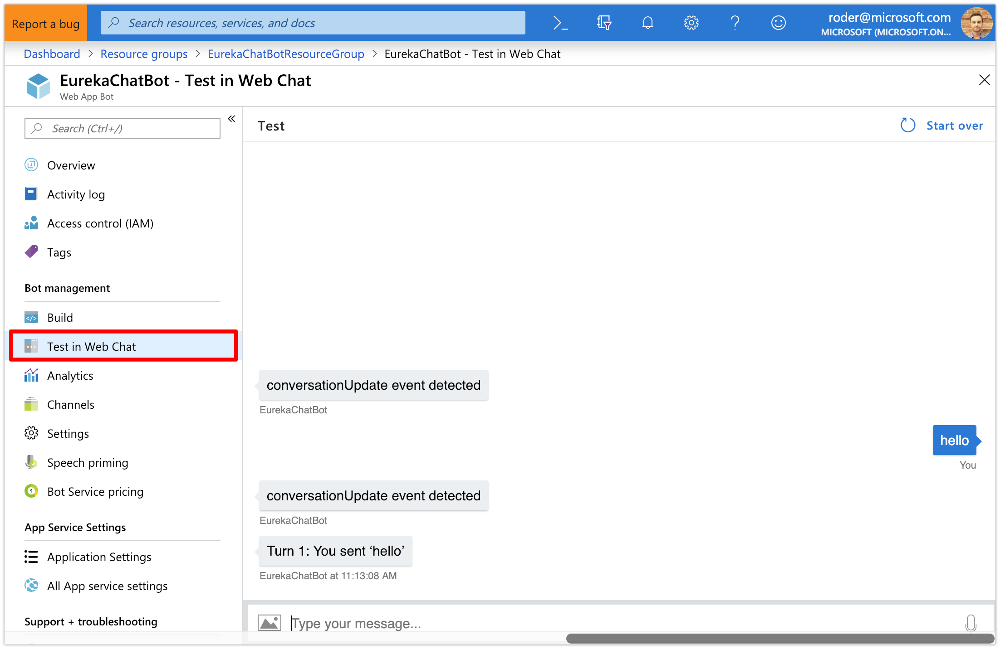
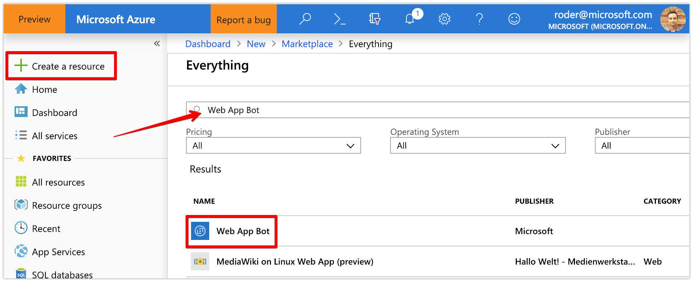
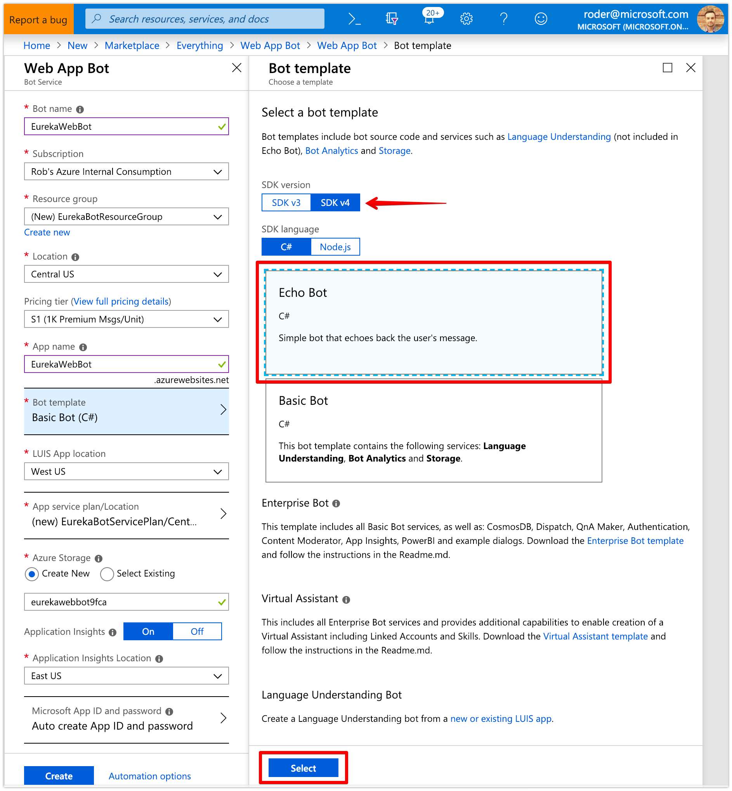
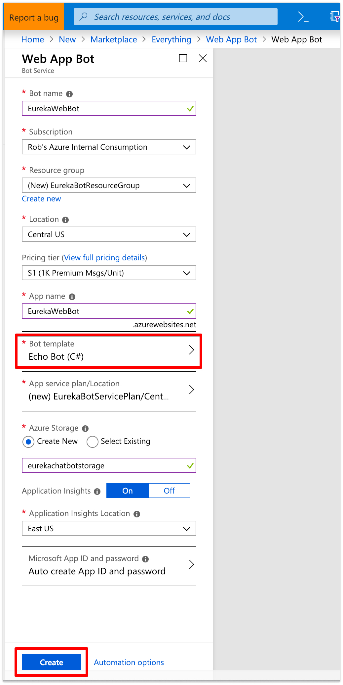
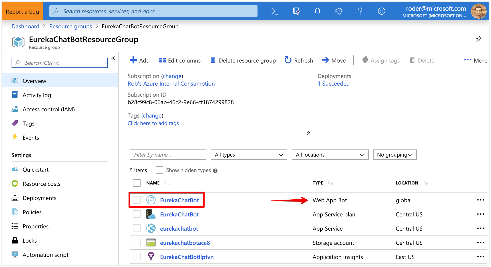

# Azure Bot Framework - Web App Bot Resources

### This guide will help you establish the basics of standing up the minimum necessary resources in Azure to get a simple bot running. We call it the Echo Bot because it echoes back the text input by the user. 

When you've completed this tutorial, you should expect to see this:
   

### Section 1: Create the Bot Services in Azure Portal

1. Browse to [https://portal.azure.com](https://portal.azure.com) and log in

1. Click the __Create Resource__ button in the top left corner and search for `Web App Bot`
 
	- Your first result should be __Web App Bot__ - go ahead and click on it

1. Click the __Create__ button at the bottom

1. Enter a unique value for the __Bot name__
	- note - this is just the name of the bot in Azure Portal and does not have to be visible to the end user. You can change the name of your bot as they appear in different channels at a later time.
1. Select the __Subscription__ under which this bot will reside

1. Choose an existing __Resource group__ or enter a name to create a new one

1. Select a __Location__ where you bot endpoint will be hosted

1. Choose a __Pricing tier__ - `S1` should suffice

1. For __App name__, you can leave it as the name of the bot specified in Step 1 or you can modify it here

1. Click __Bot template__ to show the Bot template blade

1. Ensure `SDK v4` is selected, `C#` as the language and choose `Echo Bot` as the template

1. Click __Select__ at the bottom to lock in the `Echo Bot` as the template to use
 

1. Select an existing __App service plan__ or create a new one
	- why do you need an App Service Plan? to host the App Service where the bot endpoint will be running
1. Leave the defaults for __Azure Storage__ and __Application Insights__

1. For __Microsoft App ID and password__, leave this as `Auto create App ID and password`
	- note - we won't be using this for this sample but the App ID and password are needed for authentication and to connect your bot to 3rd party channels, like Teams)

1. Ensure the bot template is now set to `Echo Bot (C#)` and click the __Create__ button
 

1. Grab a coffee because it'll take a few minutes for Azure to create all the necessary resources but you should see a notification stating your deployment is underway
 

1. Once your deployment finishes, click on the __Go to resource__ button or search for the name of the resource group in the search bar
 

1. You should now be in the Resource Group which lists all of the services created for your bot to run
 

 

### Section 12: Test Out the Bot Using Web Chat 

In addition to all the new services that were just created to support your new bot, the code template selected previously (Echo Bot) has also been built and deployed so we can interact with the bot right away even though we don't have any local code yet.

1. Click on your bot (the resource type will be `Web App Bot`)

1. Let's do a quick test to make sure everything is working by clicking on __Test in Web Chat__
 

1. Type a word and ensure the bot echoes back the same word you typed

1. Pat yourself on the back, you just deployed your first bot