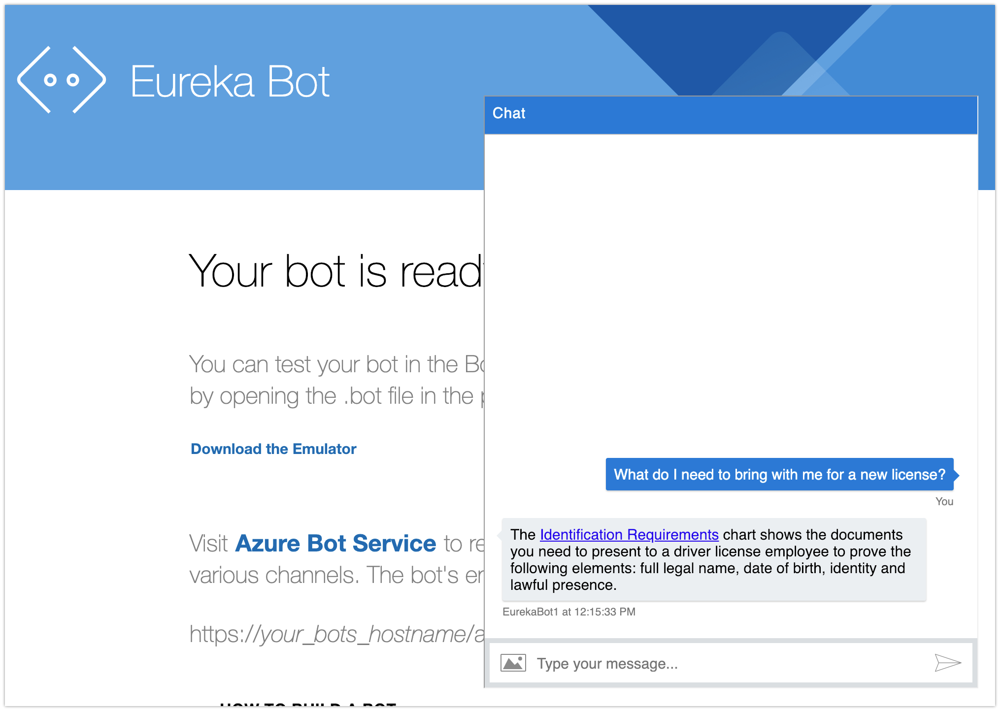
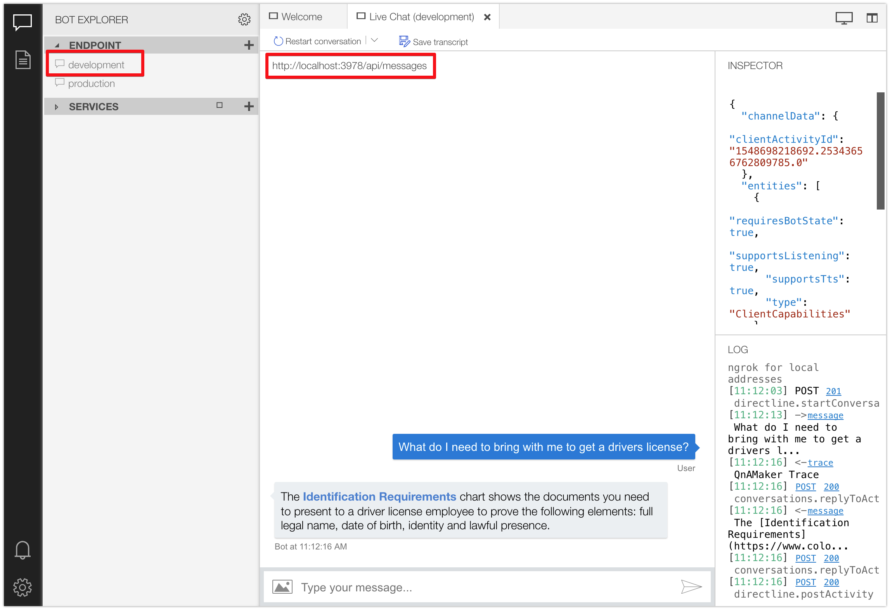
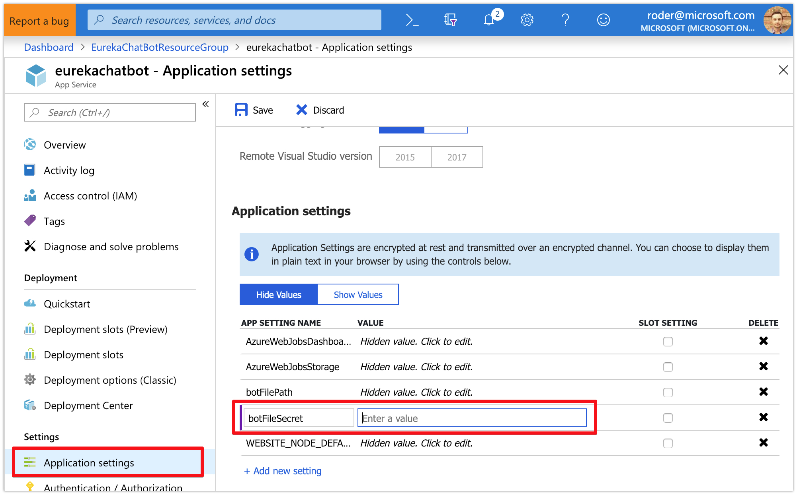
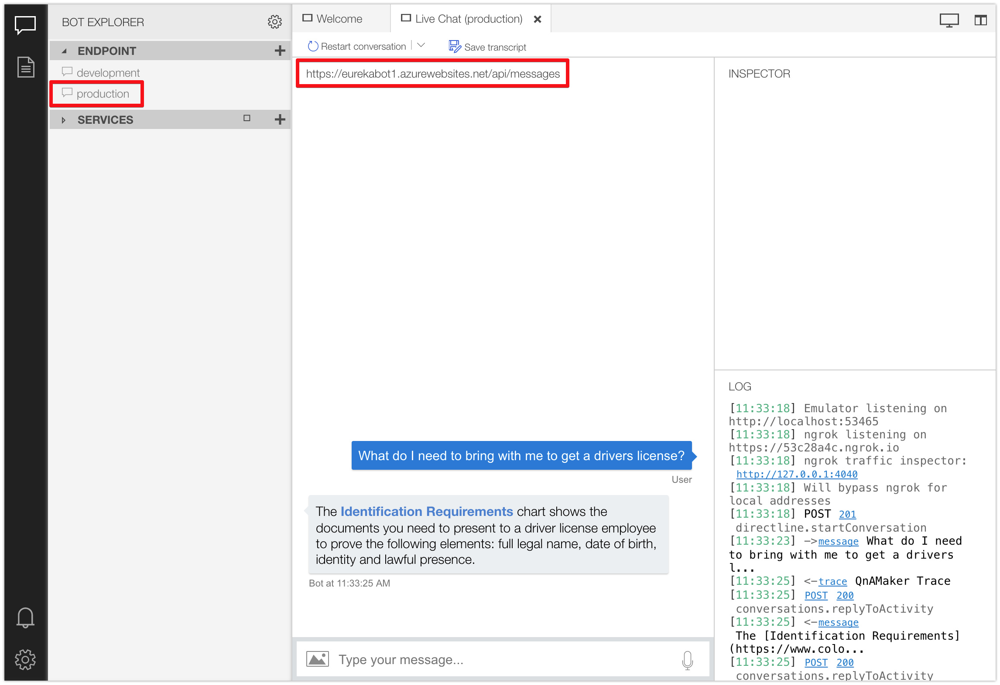

# Azure Bot Framework - QnA Maker Bot Integration

### This guide will help you integrate an existing QnA Maker knowledge base into your bot.

When you've completed this tutorial, you should expect to see this:
<br/><br/><br/>

### Section 1: Modify the .bot Configuration File

[The .bot file](https://docs.microsoft.com/en-us/azure/bot-service/bot-file-basics) contains configuration data about your bot and the services it uses. It contains the development and production endpoints, the bot app ID and password to connect to the Bot Connector Service, and endpoints, keys and other settings used by other cognitive services.

The .bot file is used in a few different ways. It's what the Bot Framework Emulator uses to connect to your bot locally and publicly. It's also used in `ConfigureServices` method in the `Startup` class of our .NET Core bot to read in the endpoints, keys, etc for cognitive services used within the bot, such as Translation, Spell Check, QnA Maker and LUIS.

Because the .bot file contains sensitive information, it should be encrypted using a secret. Both the .bot file path and the secret are defined in the `appsettings.json` file locally and in the __Application settings__ of the App Service in the Azure Portal.

We need to add the QnA Maker endpoint key, host and knowledge base ID to the .bot file which we'll later read in and use. But because the .bot file is encrypted, we first need to decrypt it using the [__msbot__]((https://github.com/Microsoft/botbuilder-tools/tree/master/packages/MSBot#installation)) command line tool.

1. Ensure you have __msbot__ installed by typing:
	```
	msbot -h
	```
	- if you do not have __msbot__ installed already, use __npm__ to install it:
		```
		npm install -g msbot
		```

1. Locate the .bot file secret in either the `appsettings.json` file or in the __Application settings__ of the bot's App Service in Azure Portal

1. Run the following command in the root of your project and verify the contents of the .bot file are now unencrypted:
	```
	msbot secret --clear --secret <YOUR SECRET HERE>
	```

1. Add the following json to your .bot file anywhere in the `services` node array and replace with your knowledge base ID, endpoint key, host URL and then save
	```
	{
		"type": "qna",
		"endpointKey": "<YOUR_QNA_KB_ENDPOINT_KEY>",
		"hostname": "<YOUR_QNA_HOST_URL>",
		"kbId": "<YOUR_QNA_KB_ID>"
	}
	```

1. Set the value of `botFileSecret` to `""` in the `appsettings.json` file now that your .bot file is decrypted

<br/>

### Section 2: Integrate the QnAMaker .NET Core SDK

1. QnA Maker supports REST API but we'll take advantage of the SDK support by adding the following nuget package:
	```
	dotnet add package Microsoft.Bot.Builder.AI.QnA
	```

1. Open the `Bot.cs` file and create a private static variable within the `EurekaBot` class for our `QnAMaker` object, then and add the necessary `using` statement
	```
	static QnAMaker _qnaMakerService;
	```

1. Add a method to create the value for `_qnaMakerService` if not already assigned
	```
	void EnsureQnAMakerService()
	{
		if(_qnaMakerService != null)
			return;

		//Iterate through all services in the .bot file and get the first one with 'qna' as the type
		var service = _botConfiguration.Services.FirstOrDefault(s => s.Type == ServiceTypes.QnA) as QnAMakerService;

		var qnaEndpoint = new QnAMakerEndpoint()
		{
			KnowledgeBaseId = service.KbId,
			EndpointKey = service.EndpointKey,
			Host = service.Hostname,
		};

		_qnaMakerService = new QnAMaker(qnaEndpoint);
	}
	```

1. Add a method to execute the answer look-up in the knowledge base
	```
	async Task LookupAnswerInKnowledgeBase(ITurnContext turnContext, CancellationToken cancellationToken = default(CancellationToken))
	{
		if (string.IsNullOrEmpty(turnContext.Activity.Text))
			return;

		//Make sure we have a valid QnAMaker service to use
		EnsureQnAMakerService();

		//Get any possible answers to the question typed
		var results = await _qnaMakerService.GetAnswersAsync(turnContext);
		if (results != null && results.Any())
		{
			//Return the first result (you could also ensure the result.Score is of a minimum threshold)
			await turnContext.SendActivityAsync(results.First().Answer, cancellationToken: cancellationToken);
		}
		else
		{
			await turnContext.SendActivityAsync(_configuration["noAnswerMessage"], cancellationToken: cancellationToken);
		}
	}	
	```

1. Now let's make the call to look up possible answers in the knowledge base by replacing the code within the `ActivityTypes.Message` switch/case statement in `OnTurnAsync` with the following and save:
	```
	await LookupAnswerInKnowledgeBase(turnContext, cancellationToken);
	break;
	```

1. That should do it, time to test it out by hitting `F5` to start the local debugger

1. Launch the Bot Framework Emulator and ensure __development__ is selected as the endpoint

1. Type a question phrased similar to a question in your knowledge base and confirm the appropriate answer was send back by the bot
<br/>


### Section 3: Deploy to Azure

1. Before we can deploy to Azure or even push the changes to your repo, we need to re-encrypt the .bot file to keep our keys private so let's run the following command in the root of your project:
	```
	msbot secret --new
	```
	which should return something similar to this:
	```
	Your bot is encrypted with secret:
	lC0zcp5jxoFu9ya4iDuovIUYTRa5F1icvY49uzBUeXDo=

	Please save this secret in a secure place to keep your keys safe.
	```

1. Copy the new key that was generated to somewhere safe - you'll need to enter it into the Bot Framework Emulator again as well as the `appsettings.json` file to test locally and modify the __Application settings__ of our App Service

1. Browse to [https://portal.azure.com](https://portal.azure.com) and log in

1. Navigate to the Resource Group that contains your bot services

1. Click on the App Service hosting your bot

1. Click on the __Application settings__ section

1. Scroll down to find the `botFileSecret` key and set the value to the key generated in the previous step
<br/>

1. Commit your changes to git and push to your remote repository to kick off a new build and deploy
	- note - it is not advised to commit the `appsettings.json` file containing the `botFileSecret`
	- you can confirm the automated pipeline is working by visiting the __Deployment Center__ section of the App Service hosting your bot in the Azure Portal

1. Test your bot in the web chat and the Bot Framework Emulator to ensure your public endpoint is functioning properly
<br/>

<br/>

### Section 4: Add Chat Bot to Web Page

Now that we have a working public endpoint, we can add enable one of the several bot channel options available to us, Web Chat by adding a few lines of HTML to our web page.

1. Open the `wwwroot/default.htm` file and add the following code just before the `</body>` close tag:
	```
	

	<iframe id="chatFrame" src='<YOUR_BOT_EMBED_CODE_SRC>'
		style='visibility: hidden; width: 500px; height:600px; position: absolute; bottom: 20px; right: 20px; background-color: #FFF; border-width: 1px'></iframe>

	```

	note - embedding the secret in javascript makes it easy for other developers to embed your bot in their pages. for best practices, you should [exchange the secret for a time-based token](https://docs.microsoft.com/en-us/azure/bot-service/bot-service-channel-connect-webchat?view=azure-bot-service-4.0#option-1---keep-your-secret-hidden-exchange-your-secret-for-a-token-and-generate-the-embed). it's a little bit more work but much more secure. 

1. To get the URL that the `iframe` needs to point to, navigate to your Web App Bot in the Azure Portal

1. Click on the __Channels__ section

1. Click on the __Edit__ link under Web Chat
<br/>

1. Here you'll find 2 secrets and HTML embed code - copy the value of the `src` property of the `iframe` and paste it over `<YOUR_BOT_EMBED_CODE_SRC>`

1. Back in the Azure Portal, click the __Show__ link next to one of the secret keys to expose the value, copy it and paste it over the `YOUR_SECRET_HERE` so the value of the `iframe`'s `src` property in your code looks similar to this:
	```
	https://webchat.botframework.com/embed/EurekaChatBot?s=gKVaFfVTvks.cwA.8cc.YX7eSxJDJKDfgWsqMlOEh25Jl7EOSKWKQIn-Imth9XSo
	```

1. Save the file and hit `F5` to launch the local debugger

1. In a web browser, navigate to `http://localhost:3978` and click on the chat icon in the lower right corner

1. Ask a question and verify the appropriate answer is returned by the bot
<br/>

1. Commit and push your code to your repository to trigger a build and deploy in Azure, then re-test against your public endpoint