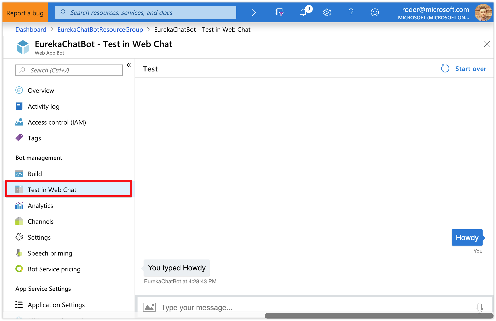
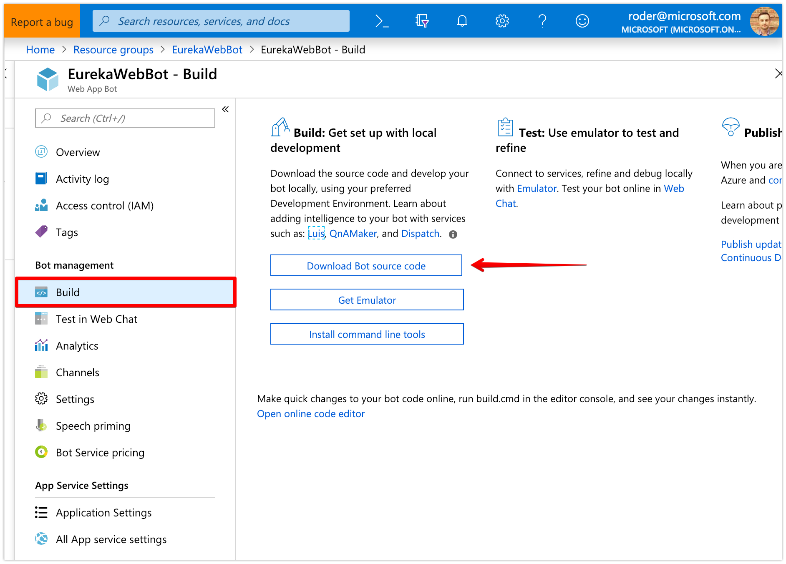
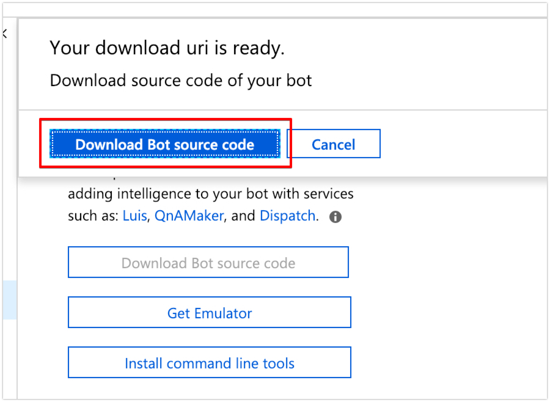
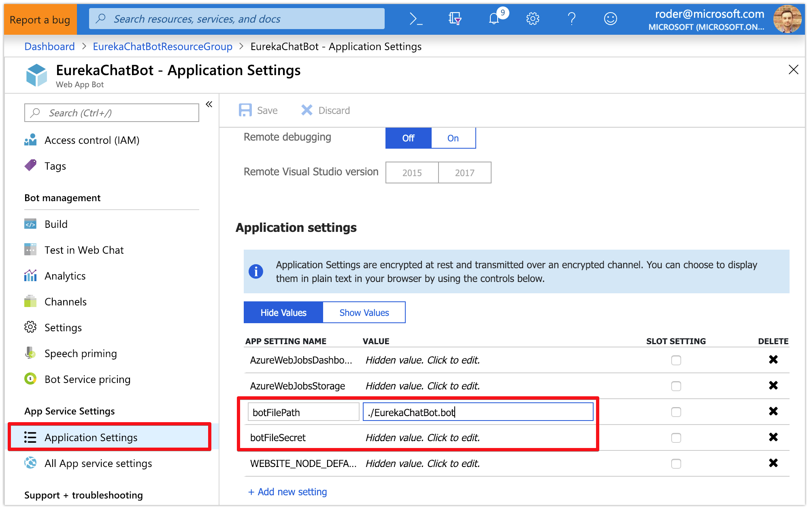
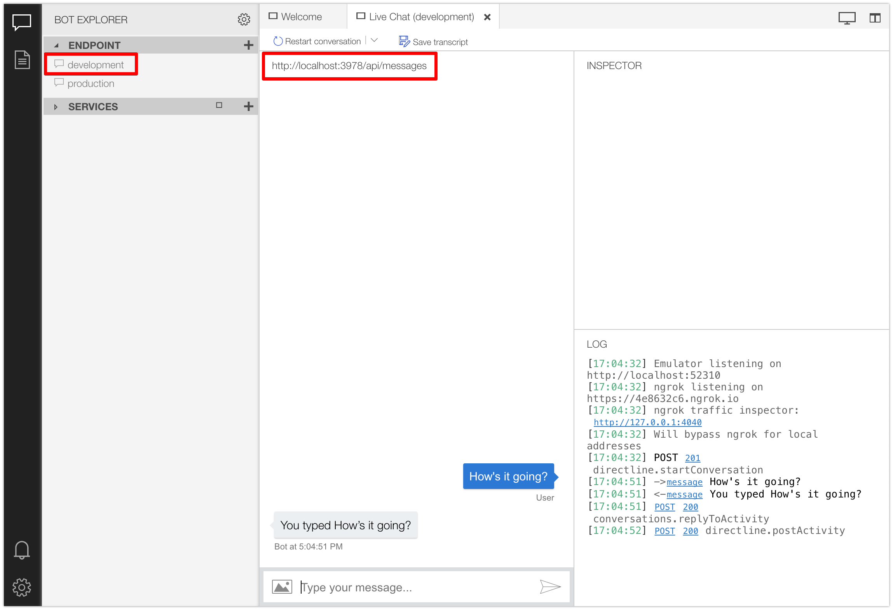
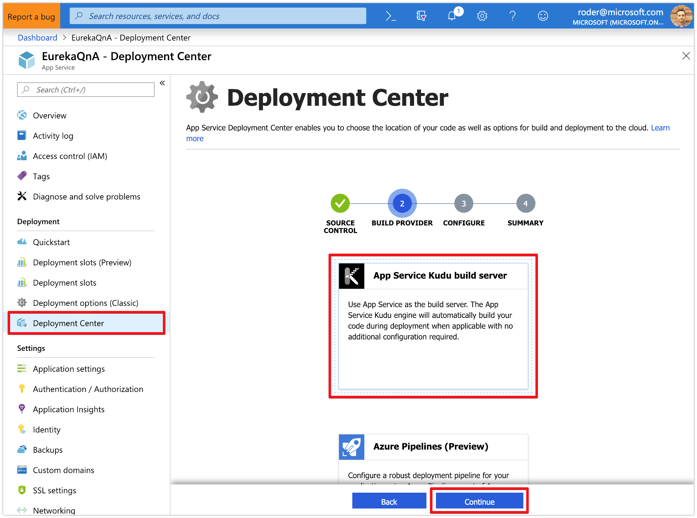
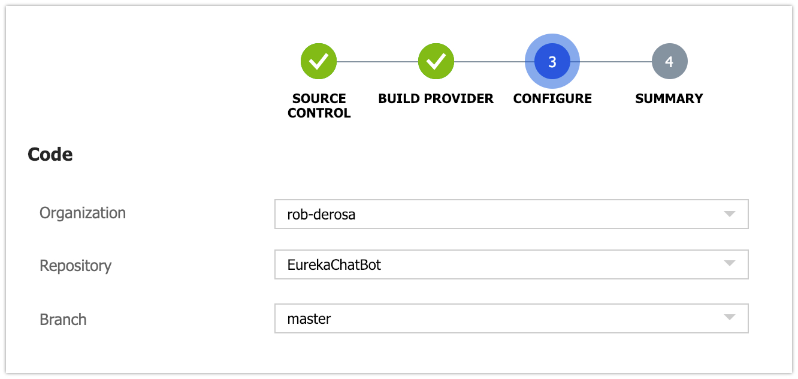
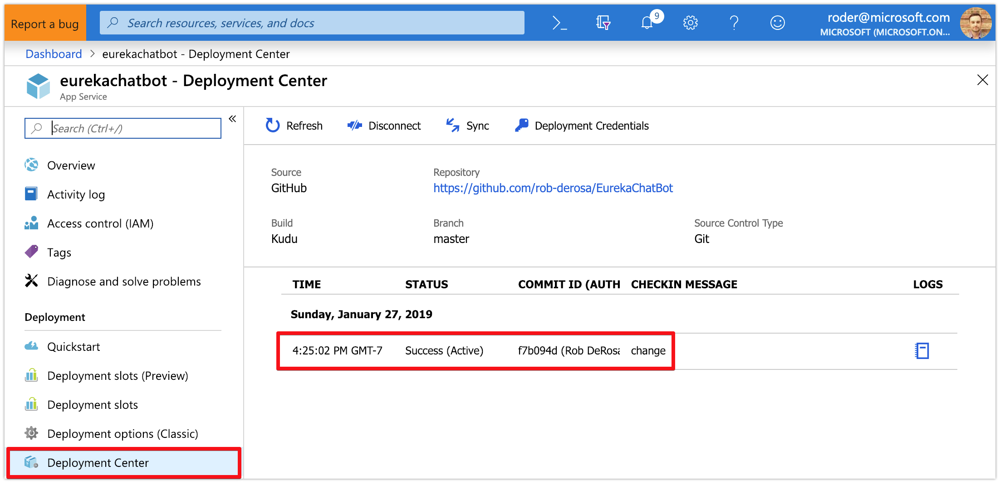
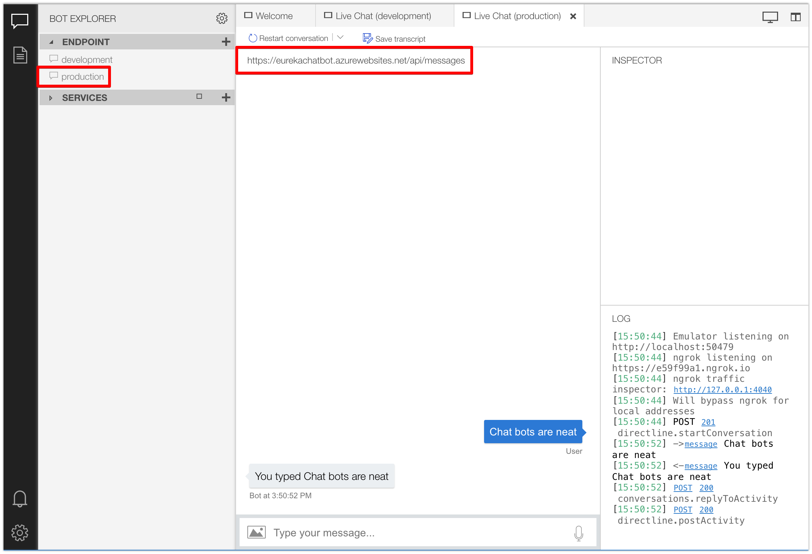

# Azure Bot Framework - Debugging and Deploying Your Bot to Azure

### This guide will help you get local debugging working so you can step through code. Then we'll deploy your bot using CI/CD against your code repository. 

When you've completed this tutorial, you should expect to see this:
<br/><br/><br/>

### Section 1: Download the Generated Boilerplate Code

1. Browse to [https://portal.azure.com](https://portal.azure.com) and log in

1. Navigate to the Resource Group that contains your bot services

1. Click on the Web App Bot service

1. Click on the __Build__ section

1. Click the __Download Bot source code__ button
<br/>

1. It can take up to 5 - 10 minutes to create the .zip file of the generated Echo bot code but it's important __NOT__ to navigate anywhere or close the window that is preparing the download URI

1. Click the __Download bot source code__ button once it shows up and save the file to a local directory, then unzip
<br/>

1. Clone [this repository](https://github.com/rob-derosa/EurekaBot) `git clone https://github.com/rob-derosa/EurekaBot.git`

1. In VS Code, open the project located at `src/start_here/EurekaBot` - this will be our baseline for our QnA bot

1. Copy the .bot file in the bot source code you download in the previous step into the root of this project
    - the .bot file contains several configuration keys needed by the bot to run

1. In the `appsettings.json` file, specify the path to the `.bot` file you just copied over as well as the bot file secret
    - you can find the bot file path and secret in the __Application settings__ of web bot in the Azure Portal
	<br/>
	example:
	```
	"botFilePath": "./EurekaChatBot.bot",
	"botFileSecret": "RLhkzCUeiwHGluudy7Ny5SGEzaVmHkalBRJXSGECVM=",
	```

1. Open the `Bot.cs` file and check out the code, specifically the `OnTurnAsync` method and the `TurnContext` object - this is where your bot gets the opportunity to determine the `ActivityType` and act accordingly (i.e. `Message`, `ConversationUpdate`, `EndConversation`, `Typing`, etc)

1. In VS Code, open the terminal (__Terminal > New Terminal__) and type `dotnet build` and ensure there are no build errors

1. Type `F5` to start debugging the bot endpoint locally and look for the `localhost` endpoint in the console output - it should be something similar to `http://localhost:3897`

1. Open the Bot Framework Emulator and click the __Open Bot__ button, then select the .bot file in your project

1. Enter the bot file secret from the `appsettings.json` file and paste it to allow the emulator to read the configuration settings, click __Submit__

1. Ensure __`development`__ is selected as the endpoint to hit

1. Type a message and hit enter - the bot should echo the message right back to you
<br/>

<br/>

### Section 2: Configure CI/CD to Deploy on Commit

1. In the online repository option of your choice, create a new repository to host the source code for this project

1. Commit and push the project source code of root of this project to the `master` branch

1. Browse to [https://portal.azure.com](https://portal.azure.com) and log in

1. Navigate to the Resource Group that contains your bot services

1. Click on the App Service tied to your bot

1. Click on the __Deployment Center__ section

1. Choose the Source Control Provider (i.e. Github) where your code is checked in and click __Continue__

1. Choose __App Service Kudu build server__ as the Build Provider and click __Continue__
<br/>

1. Complete any settings specific to the source control provider selected in the previous step such as the organization, repository name and branch to watch and click __Continue__
<br/>

1. If all the settings look good, click the __Finish__ button - this will create the connection to the repo and automatically build and deploy your project whenever you push a commit to your master branch
<br/>

1. Test that your bot is working properly by navigating to your Web App Bot and select the __Test in web chat__ section
<br/>
If everything worked, you should see the same behavior as you did locally - the bot should echo back the message you typed

1. We can also test using the Bot Framework Emulator - just select the `production` endpoint this time and send a message
<br/>

Congrats! You are now free to make changes, commit and push them and your changes will automatically be deployed to your public instance