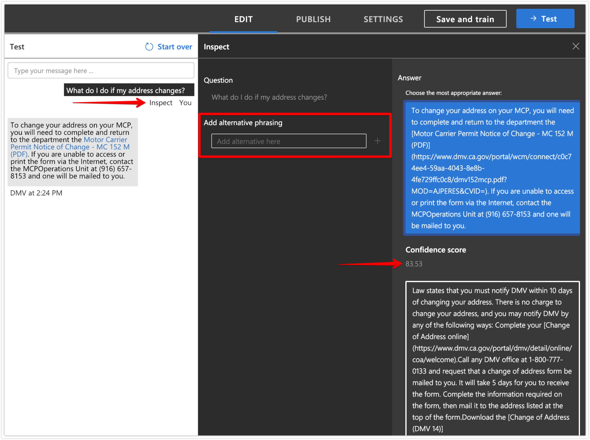
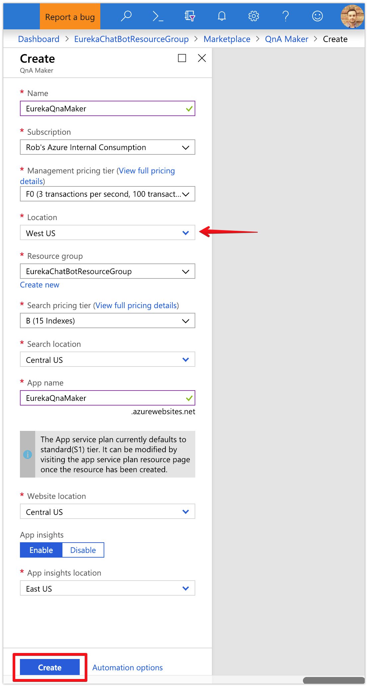
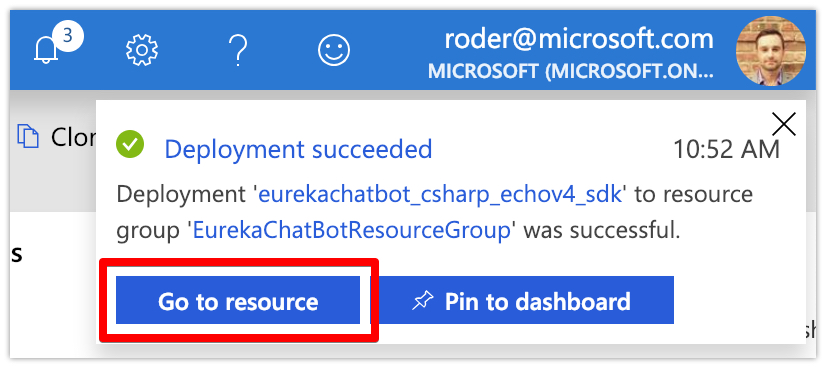
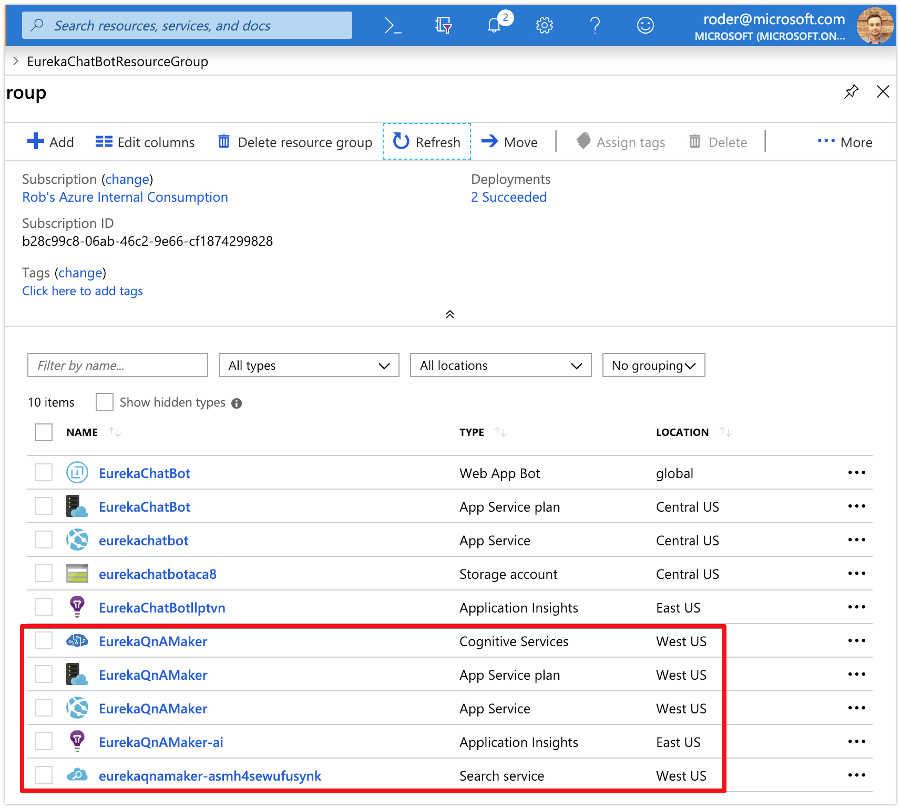
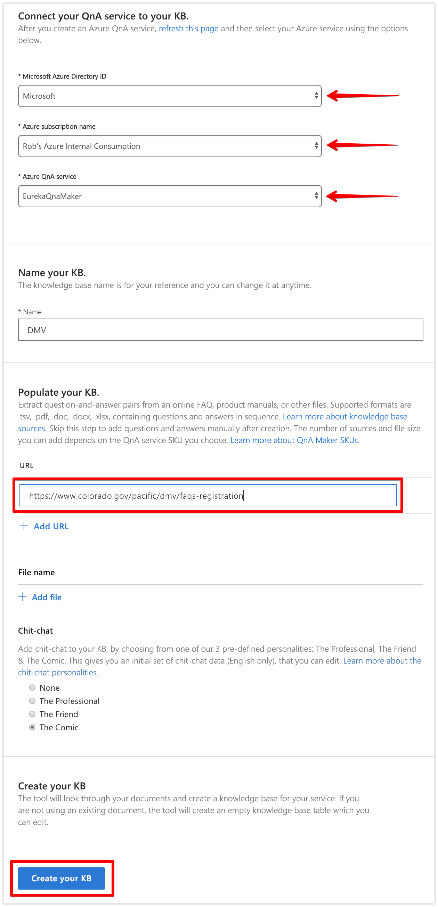

# Azure Bot Framework - Creating a QnA Maker Knowledge Base

### This guide will help you establish the basics of connecting an existing bot to a QnA Maker knowledge base
#### Note - this guide assumes you already have a [working bot deployed in Azure](bots-echo.md)

When you've completed this tutorial, you should expect to see this:
<br/><br/><br/>

### What is QnA Maker?

Azure's QnA Maker service makes it easy to import existing knowledge base data (docs, spreadsheets, online HTML FAQs, PDFs, etc) into an intelligent data store that can then be searched using natural language. Under the hood, QnA Maker is composed of the following Azure services:
- Azure Search for indexing the knowledge base and providing query capabilities
- Azure App Service to host the WebAPI REST endpoint for incoming requests
- Azure App Service Plan to host the App Service above
- Azure Cognitive Service to host the keys for your QnA Maker service and for billing
- Application Insights to track telemetry (optional)


<br />

### Section 1: Create the QnA Maker Services in Azure Portal

1. Browse to [https://portal.azure.com](https://portal.azure.com) and log in

1. Click the __Create Resource__ button in the top left corner and search for `QnA Maker` and click on the first result

1. Click the __Create__ button at the bottom
<br/>

1. Enter a unique value for the __QnA Maker Service__
	
1. Select the __Subscription__ under which this bot will reside

1. Before attempting to change the __Management pricing tier__, change the __Location__ to `West US`, then select `F0` for the pricing tier

1. Choose an existing __Resource group__ or enter a name to create a new one

1. Choose a __Search pricing tier__ - `B (15 Indexes)` should suffice

1. Select a __Search location__ or leave the default

1. For __App name__, you can leave it as the name of the QnA Maker service specified in Step 1 or you can modify it here

1. Select a __Website location__ or leave the default

1. You can disable __Application Insights__ but it is recommended to leave it enabled

1. Click the __Create__ button at the bottom

1. Grab a coffee because it'll take a few minutes for Azure to create all the necessary resources but you should see a notification stating your deployment is underway
<br/>

1. Once your deployment finishes, click on the __Go to Resource__ button or search for the name of the resource group in the search bar
<br/>

1. You should now be in the Resource Group which lists all of the services created for your QnA Maker service to run
<br/>

	Now that all the necessary services have been spun up, we can move over to the QnA Maker Portal where we'll create a new knowledge base and import existing FAQ info into it.
	 
<br/>

### Section 2: Create a Knowledge Base in the QnA Maker Portal

1. Browse to [https://qnamaker.ai](https://qnamaker.ai) and log in with the same credentials used in Section 1

1. Click on __Create a knowledge base__ at the top

1. We just completed STEP 1 so lets move on to STEP 2, __Connect your QnA service to your KB__

1. Select the __Microsoft Azure Directory ID__ to which your subscription is tied

1. Select the __Azure subscription name__ you used in Section 1 above

1. Select the __Azure QnA service__ you created in Section 1 above

1. In STEP 3, give your new knowledge base a unique name
<br/>

1. In STEP 4, add some existing FAQs to populate your knowledge base with info from an online source using a URL or upload a document or spreadsheet containing this data
    - if you don't have existing data to import on hand, search online for a FAQ page from your company
    - fallback URL if needed: https://www.colorado.gov/pacific/dmv/faq-driver-license
    - you can add more than 1 source of information into a single KB but should typically be grouped by topic (i.e. all FAQs related to DMV Licensing)

1. You can optionally give your bot some personality but selecting one of the pre-defined personality types
    - Chit-chat will allow your bot to answer basic questions ("hello", "how are you?", etc) and interact with the user moderately

1. Click the __Create your KB__ button at the bottom - it will take a minute or two for your knowledge base to be created

<br/>

### Section 3: Train, Test and Publish the Knowledge Base  

1. Before the knowledge base can be used, we need to save and train the model first - click the __Save and Train__ button at the top 
<br />

1. It will take a few seconds to complete - once ready, click the __Test__ button at the top

1. Type in a question (phrasing __does not__ have to be exact - Azure Search does a great job about selecting the best answer) and hit enter

1. Click on the __Inspect__ link under the question you typed - this will allow you to see the top answers along with the confidence score
    - you can change the answer to the question if it's incorrect
	- you can add additional phrasing to an answer if there is more than one way of asking that question
	- if you make any changes, don't forget to save and re-train
<br />

1. Click the __PUBLISH__ button at the top

1. Confirm you wish to publish this knowledge base into production by clicking __Publish__ again 

1. After a few seconds, you'll see the publish confirmation - from here we can extract the following values we'll need when using the QnA Maker SDK in .NET code:
   - the knowledge base ID can be found in the POST path `/knowledgebases/<KB ID HERE>/generateAnswer`
   - the endpoint key
   - the host URL to point towards

   You should have something like this - store them somewhere temporarily
     ```
	 KBID: bd264f91-30ea-452e-8480-f12cc50f123c
     Host: https://eurekaqna.azurewebsites.net/qnamaker
     Endpoint Key: 08504335-4c96-41c5-b8ff-39343ee6c6ff
	 ```